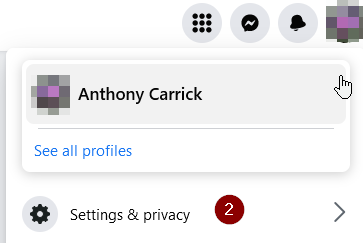
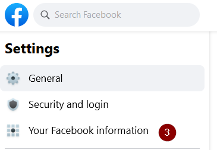
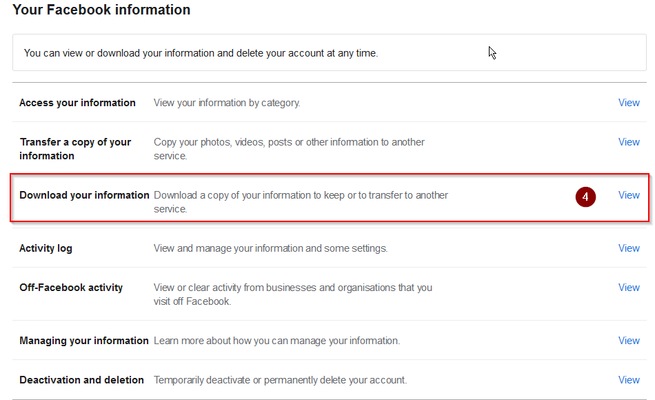
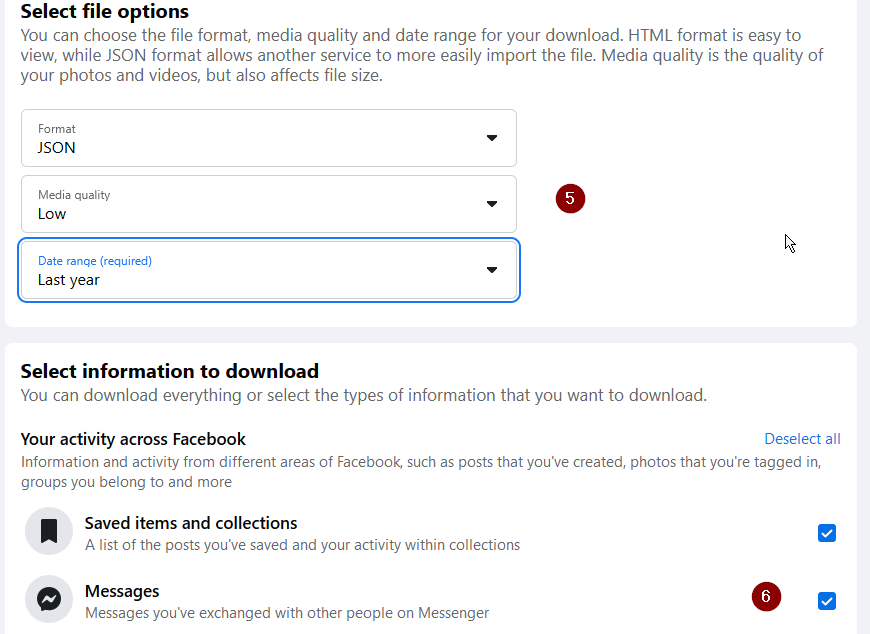
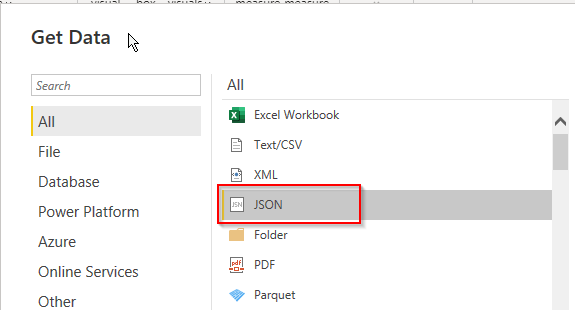
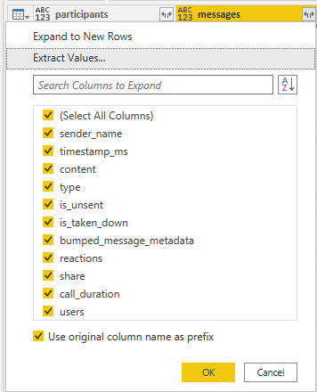
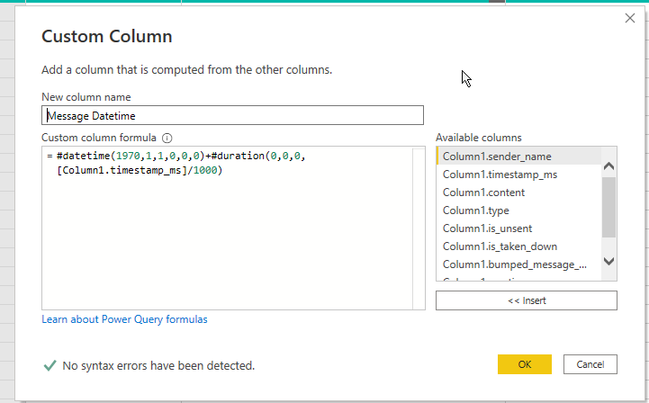

I'm in a group chat with some friend groups and it came up in conversation about who sends the most gifs or messages. So checked the Facebook Archive and it does include group chats and reasonably rich data in either HTML or JSON format. I downloaded my archive and processed it in Power BI. I assume some experience with Power BI

# Getting Your Chats

1. Go to Facebook
2. Click your Profile menu > Settings and Privacy > Settings
3. Then click "Your Facebook information"
4. Click Download your information (https://www.facebook.com/dyi/?referrer=yfi_settings)
5. Choose JSON, Low media quality, and a Date range of your choosing.
6. Deselect everything and reselect Messages. (Or just grab it all, but for this exercise we only need Messages.)
7. Scroll down to the bottom of the page and Click "Request a download". You can go away and Facebook will notify you when it's ready. The ZIP archive will be unsecured and contains all chats you've been involved in so be careful with it!
8. Save the ZIP file and extract it to a handy location. It might be large if you send or receive a lot of media. The messages will be a folder "messages" then "inbox" then the name of the chat with spaces removed plus some random letters at the end.

# Adding to Power BI

Once you have the JSON files containing your chats there were a few steps to process them in Power BI.

## Get Data and Append

1. In Power BI, get the data as JSON. Browse to the location of the chat you are interested in. There may be multiple chat files if it's a really busy or long chat. Select the first "message_1.json" file.
2. In the Power Query Editor, it will have already applied some steps for you. Expand the "messages" List column to "New Rows". Now one row per "messages" record is created".
3. Expand "messages" again from \[Record] type to columns for each field in the message object. Just choose all columns. You may need to click Show More if Power BI hasn't loaded all the headers.

Optionally, you can click the '\[List]' in the 'messages' column then Convert To Table and Expand that as in Step 3. This will provide you with just the messages themselves but the archive provides other interesting data like your "magic words" (the animated emojis that popup when certain words are typed), and all participants.

Then repeat the above steps for every "message_x.json" file. 

Then append the rows using Append Queries in the Home tab > Combine section in the Ribbon. I like to use Append To New Rows to keep the original queries intact.

# Correct the timestamps

Facebook included the message date-time as a Unix timestamp in milliseconds. Power BI provides no built in way to handle that. I searched the internet to help. 

1. In the Add Column Ribbon tab, choose Custom Column.
2. Add a DAX expression: "`#datetime(1970,1,1,0,0,0)+#duration(0,0,0,[Column1.timestamp_ms]/1000)` (adjust column reference to match the column you expanded. Just use the picker.
3. Then change the type of the new column to a Date/Time.

# Have fun!

Now you have the message content and sender name in a row with the date time. I chose to also create Bins of the Message Datetimes into Months and Days. If you like you could Expand "reactions". This is a list per message of any reactions to the message by participants. 

As you can see in the cover photo, I made a Treemap with 

* Category: Sender_name
* Details: Message Datetime (bins of Month)
* Values: count of content (so the total messages sent)

This is therefore a Treemap of messages sent by sender and month.