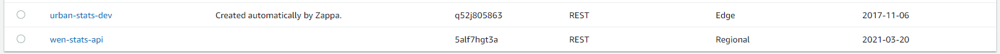
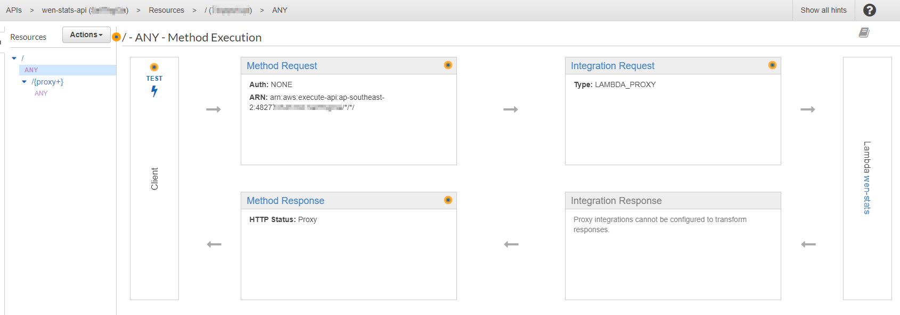
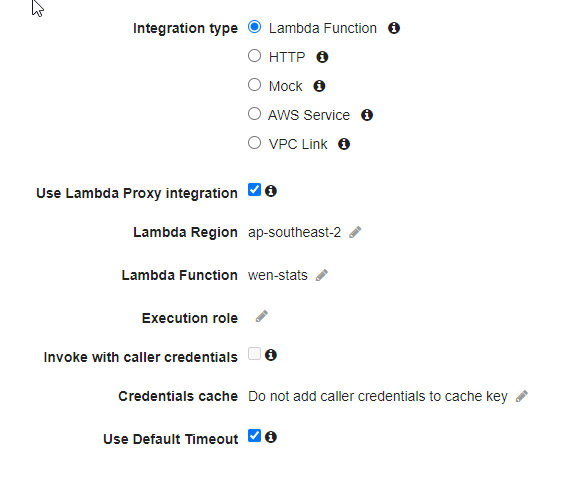
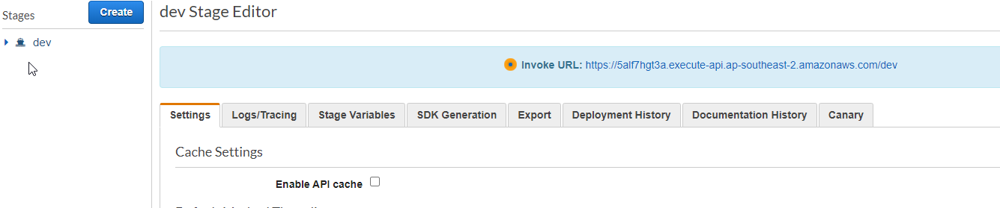
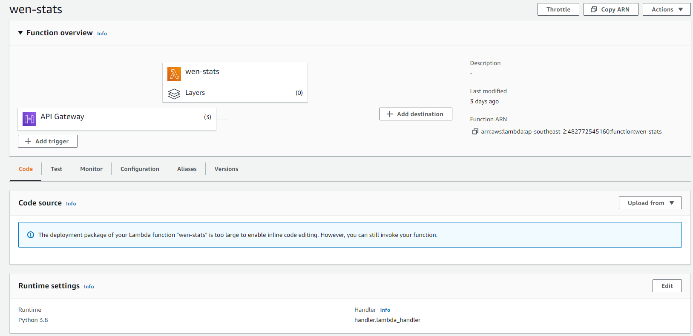

Zappa is a Python module that packages and deploys Python WSGI-based (Flask, Django) apps to AWS Lambda. Using it the recommended way, it has a whole command-line system for packaging your Flask app and deploying it to a staging environment or production and then updating it if only logic has changed but not endpoints used.
In my case though I wanted to use zappa just for packaging and recreate what it does on the AWS side - partly so I could learn about AWS (Lambda and API Gateway) further, and partly to avoid having to create a special user account for Zappa or giving it my Amazon credentials. 

## Zappa

Set yourself up in a Python Virtual Environment, install any modules from pip into the virtual environment, and put your app into a sub-folder of the virtual environment. Do the Zappa tasks from that location instead of the root of the virtual environment. 

As needed I ran `zappa init` which asks some questions about the app, with sensible defaults, and sets up its own settings file. Mainly give it your Flask app’s entry point. 

Then run `zappa package dev` and it will do some stuff and give you back a ZIP file that you can upload to Lambda yourself. Of course you can also let Zappa upload it to Lambda but I don’t want to give it access to my Amazon account and I want to learn what it does.

Zappa gave me a weird warning that the app name and virtual environment name were the same when I ran Zappa package dev though I had reconfigured the zappa-settings.json to have a different project name. After some searching I discovered that it should be in a sub-folder rather than the root. This also fixed the issue where the package zip was between 13 and 28 MB!!

## API Gateway

Zappa will automatically create an API Gateway on AWS but I want to use Zappa in ‘package’ mode rather than giving it access to my AWS account or creating an IAM for it. I first tried letting Lambda create the API Gateway for the Lambda function but I realised that Zappa actually creates a REST API type API gateway rather than a HTTP API Gateway. (There is also a WebSocket API Gateway, which is also unrelated to this task.) 

Create a new REST API Gateway and choose your Lambda function by ARN and I seemed to be able to leave everything else as default, except Integration Request where I followed what Zappa had done previously and used LAMBDA_PROXY. (I had used Zappa once before on an earlier project, I had a working example to copy from.)

To make the REST API Gateway ‘live’ you need to deploy it, creating a  stage. (This tricked me up initially as I didn’t realise it had to be activated.) This activates the API Gateway at a sub-folder of the API Gateway subdomain that AWS generated. They can be called whatever you like - ‘dev’, ‘test’, ‘prod’ would be a nice standard. I have actually called mine ‘dev’ even though it’s more like a production version of my app, but it’s a simple project so I’m not going to worry about environments.

As our Python-Flask-BeautifulSoup app needs to be packaged for Lambda by Zappa it’s of course a zip of code. Because of this you can’t directly edit the code within the Lambda console.

Because you can’t really receive an HTTP method, then start a Lambda function, then seamlessly pass along the HTTP method to the now running function, Zappa seems to receive the result of the REST API gateway, reprocess it, then resend it to our own Flask app. I think that’s what it’s doing because we need to tell Zappa what is the Python entry point of our app, then we need to tell AWS Lambda what is the function handler for the app - that is the Python code that Lambda should start once triggered.

Read about the rest of my deployment tasks and learnings here: [Weekend Notes Stats Tool](/weekend-notes-stats-tool)