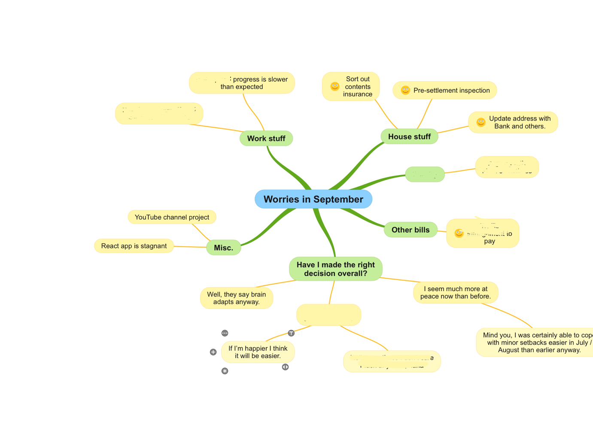
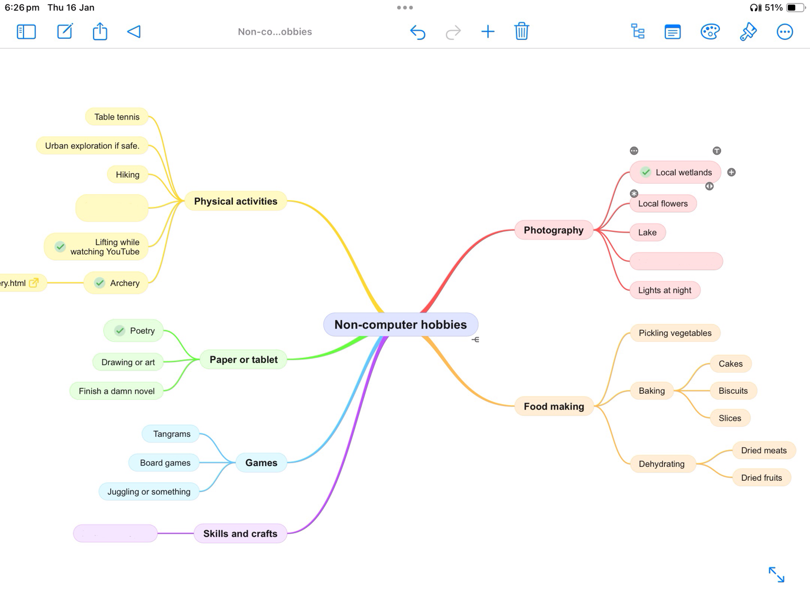
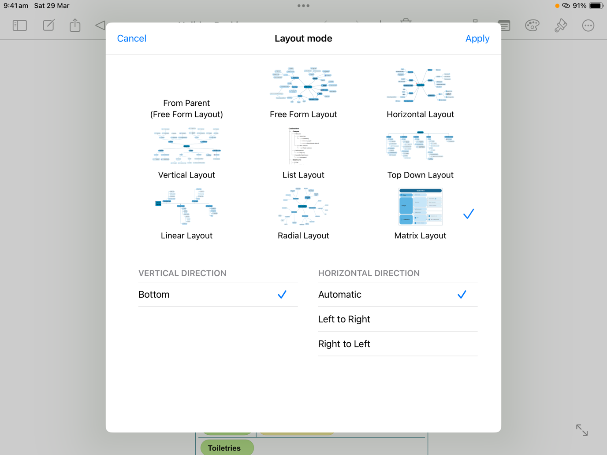
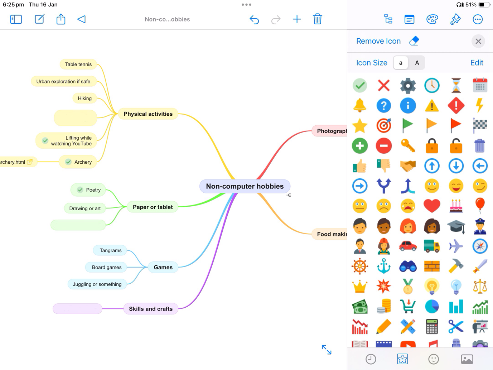
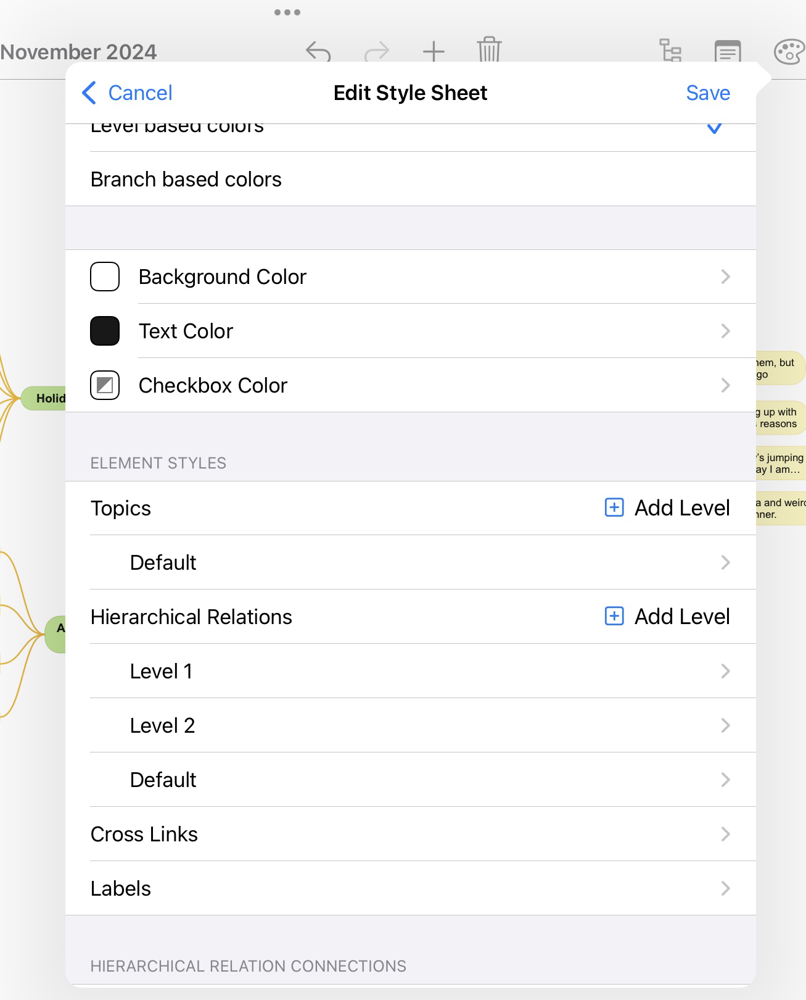

Following on from my post about journaling techniques, I've been trying
a new thought and idea discovery method based on brainstorming and
inspired by something a therapist taught me. I've been using the
[brainstorming and mind mapping software
SimpleMind](https://simplemind.eu/) on my iPad so I can brainstorm while
on the train! Following is a summary of its applications in my life and
a bit about the application itself.

# Thought Discovery

Each month, I start a new brainstorming session with the main topic as
"worries in \<month name, year\>". Then I can let my mind show me its
worries (or they might be at front of mind), and I branch then off the
central theme. Then I try to dig deeper into each worry or concern, to
find out what are the actual issues I'm feeling. After this I can branch
off each specific concern and I can try to find some solutions to those
problems or resolve that it actually isn't as bad as I thought.

# Idea Generation

I also used it for brainstorming new hobbies by starting a branch for
each kind of activity or category, then branching again for specific
activities then if needed again further for details like location or
food.

# Favourite features

What I really like about this app that I decided to buy it is its
customisation options and design choices available. And lots of
different usability features like a list of all your branches, colours
per level, several types of layouts for different purposes, emoji
tagging, plus it's easy to link nodes together or re-arrange them.

## Layouts

I like that they have built in support for various layouts, each useful
for different kinds of data representation and presentation. (Only Free
Form and Horizontal for free.)

So far, I like the following layouts:

-   Free Form and Horizontal for the above kind of brainstorming

-   Matrix for packing list or planners

-   Top down and Linear for data trees and timelines

## Emojis 

There is a button on each node that you can insert an emoji at the start
of the node, and the paid version has heaps of emojis you can choose
from (the free version only has a handful). I use these on my monthly
feeling and thought discovery sessions so I can tick off a problem after
I've solved it. But of course, you can use it for categories of hobbies
or packing or events, it's up to you!

## Customisation 

I'm impressed with SimpleMind's customisation options for a layout, like
colours and hierarchy styles. So far, I haven't customised the hierarchy
levels yet, but I'm glad you can if you wanted too.

