I’ve noticed that my monthly electricity usage has increased this year and I can’t explain why. 
| Before May | After May |
| ------ | ----- |
| 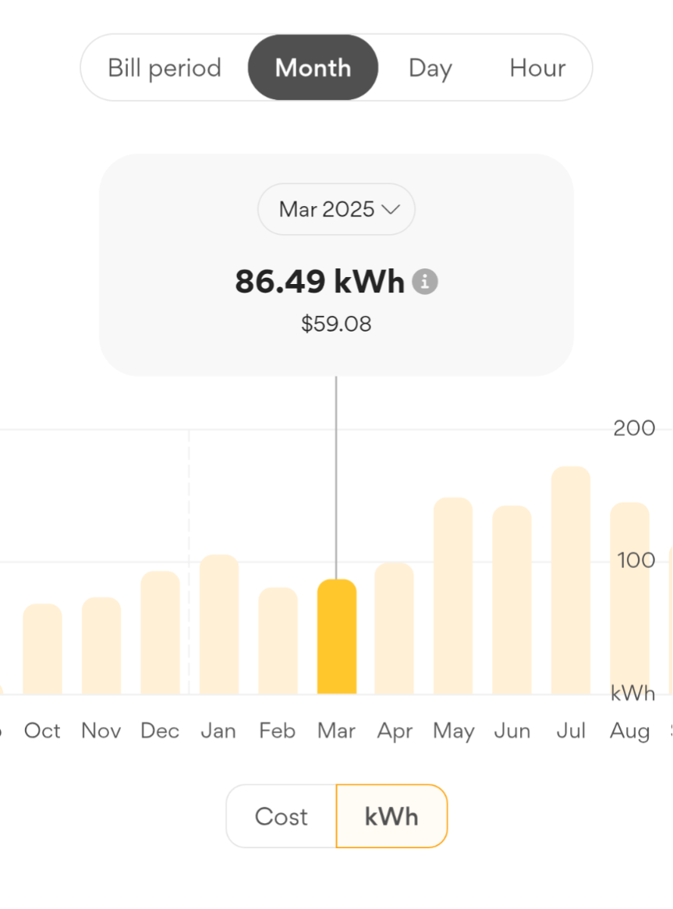 | 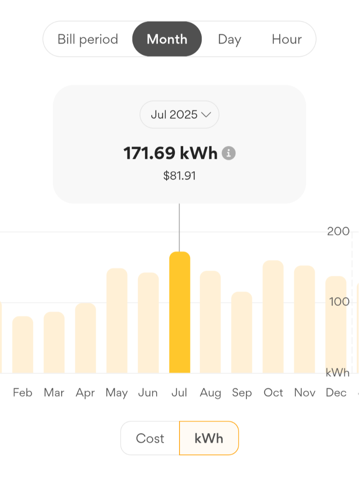 |

(October to April, it was mostly below 100 kWh and following May it was around 120 to 150 kWh.)

So I thought of downloading my usage data from the retailer in CSV format so I can try to analyse it in Microsoft Power BI. 

# Preparing the Data

My retailer provides the usage data in half-hourly blocks with each row of data representing the usage for either the first or second half of a clock based hour.

```csv
    Usage Type,Amount Used,From (date/time),To (date/time)  
    Consumption,0.056,2026-02-14T00:30:00+11:00,2026-02-14T00:59:59+11:00  
    Consumption,0.032,2026-02-14T00:00:00+11:00,2026-02-14T00:29:59+11:00  
    Consumption,0.06,2026-02-13T23:30:00+11:00,2026-02-13T23:59:59+11:00  
    Consumption,0.039,2026-02-13T23:00:00+11:00,2026-02-13T23:29:59+11:00
```
To get the data as whole hours I needed to group each row into a new row combining the first and second half hours and adding kWh usage together. To do this I created a new column Start of Hour:  
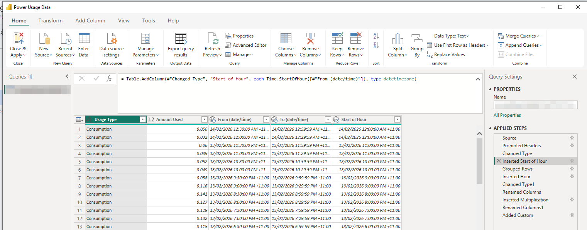

```PowerQuery
\= Table.AddColumn(\#"Changed Type", "Start of Hour", each Time.StartOfHour(\[\#"From (date/time)"\]), type datetimezone)
```
Then I grouped the rows by Start of Hour and Summed the Usage (since each row is half an hour)

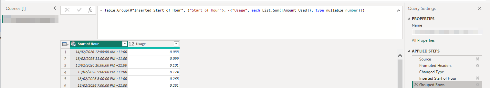

So I had the hour by itself I added a column for it to:

```PowerQuery
\= Table.AddColumn(\#"Grouped Rows", "Hour", each Time.Hour(\[Start of Hour\]))
```

To be honest, I wasn’t sure how to group by the hour (I overcomplicated the problem), so I asked ChatGPT. Don’t hate on me for being a writer using AI, I already knew what I needed to achieve but didn’t know how to do it. It actually took me a few attempts phrasing my problem with enough context around the data and technology. 

The other issue I ran into was that PowerBI doesn’t use the hour in the date hierarchy for its internal data structure \- ChatGPT said that’s just how it works.  It explained that I could create a custom hierarchy that includes the Hour by adding both the Date and Hour into the new hierarchy. 

I needed the Hour available in the data structure so that I could filter by Hour of Day to see what was the power usage at say 3am (when not much power should be being used) or 7pm (when more power is being used) \- either on a single day or graphing that hour’s usage each day over time.

Now I can create some cool graphs and sanity check the grouping by just comparing it to the graph from my retailer. 

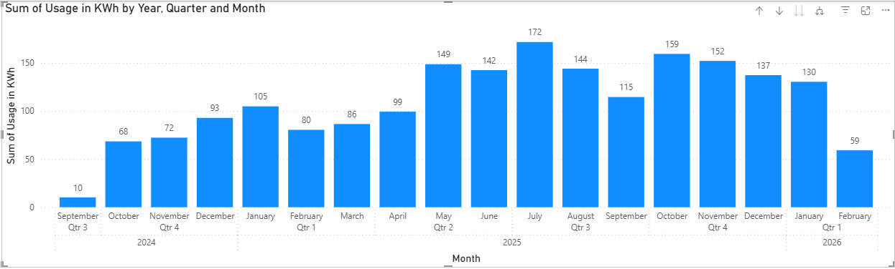
Compared with the screenshots from the retailer’s app, we can see the shape is the same, and the values are the same, though it’s rounded to 0 decimal places (that is easily fixed in the visual’s Y-value format settings).

# What Can We Discover?

To make the numbers a bit easier to work with, I added a WattHours column, which is just the Usage multiplied by 1000 (since it’s provided in KWh). This of course doesn’t gain any precision, but it’s easier to read looking at individual hours. I made another separate graph too to use it instead.

## 3am Usage

The 3am usage doesn’t seem to have jumped up suddenly in a month, implying that no one particular device is suddenly not turning off. It could be that I’ve slowly added several devices that are each drawing small amounts of power even at night.  
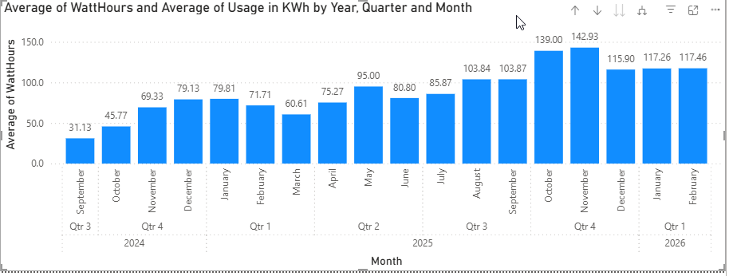
Using Average here instead of Sum to show the average 3am usage for that month, rather than the total 3am usage adding each day.

Zooming in to a day per column, from February to May we can see no particular pattern, though it’s slightly trending up. Some of the peaks would have been times I left my desktop PC on overnight.  
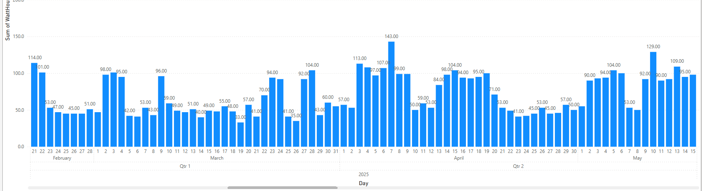

While interesting, 3am usage doesn’t tell us much yet.

Let’s look at later in the morning after I’ve woken up.

## 6am to 10am

Here we can see that there is a large increase in Average WattHours used in the 6am to 7am clock hour after May, but particularly during Winter. What could it be?

* Maybe I started to eat more microwave porridge?  
* The fans inside the gas central heating are used more.  
* It’s dark still at that time so I had more lights on.

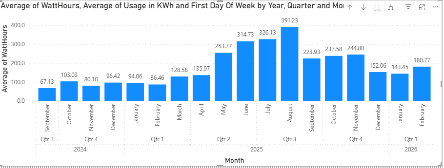

The 7am hour has an increase but it’s not as dramatic:  
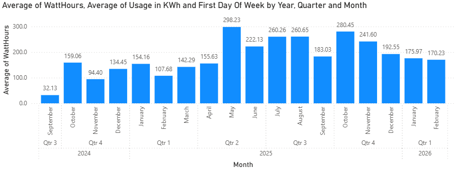

8am, 9am and 10am show increases following the month of May but no particular pattern:  
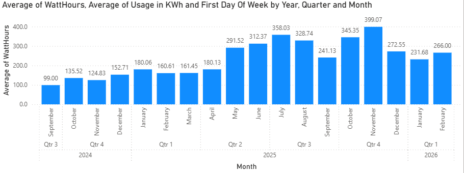
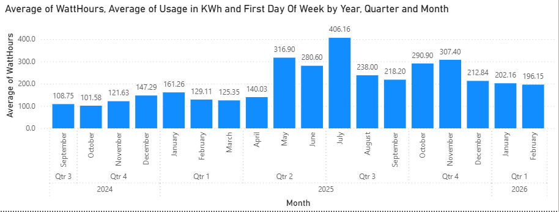

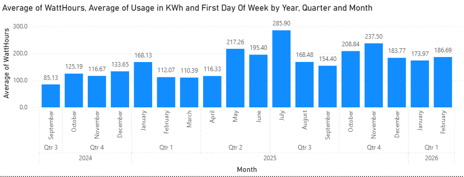

## Evening Time

The 18 and 19 hours show a marked increase in usage during Winter, but by 8pm there is no clear pattern. This would imply that the heater is using power and that by 8pm the home is already warmed so it’s not running as much. But this is unexpected to me because it’s a gas central heater and the fans in the ceiling shouldn’t be using much electricity. But if the fans inside the heating system are using 40 watts each and there’s say 3 of them \- that would probably add up to the increase we are seeing. This is worth investigating further in a future post.

The 23 hour (11pm) usage is really interesting though - it shows a large increase in Watts used starting in October:  
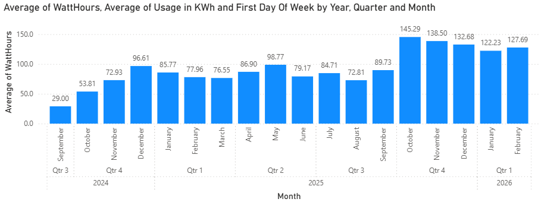
I can only think of a few things:

* I set up my old Set Top Box with shows recorded off the TV to watch  
* I set up the DVD Player auto amplifier to listen to music  
* I bought a treadmill in September and might have left it on some nights by accident. 

I wouldn’t expect any of those things to be consuming many watts in standby though, but that can be tested. I’ll revisit that idea in a later post.

The Midnight (0 hour), 1am, 2am, 3am, average and monthly sum usages, show increases still, but the watts used in those hours generally are too few to reliably draw any conclusions from.

## Rolling Average

By adding a Moving Average we can see that the 3am usage since May is higher, there are still individual days where it’s lower. Go to “New Visual Calculation” on the Ribbon to add one. I made it 2 intervals either side.  
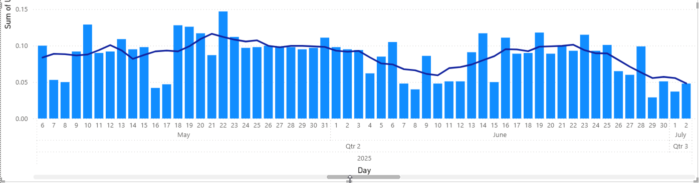

# Closing

Now we have this data and visuals, we can easily explore hypothesis by correlating the usage with say the weather, what days I was home or not, and power consumption of devices. I bought a plug in power meter so I can check on the usage of different devices. I’ll explore that in a later post as well as the heating usage.