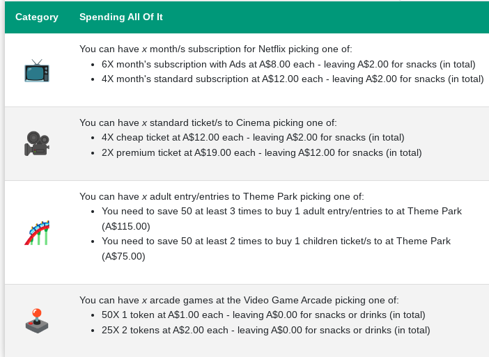
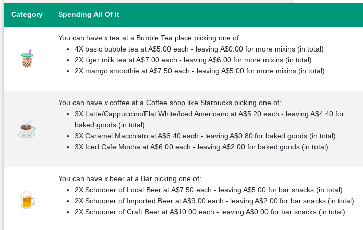
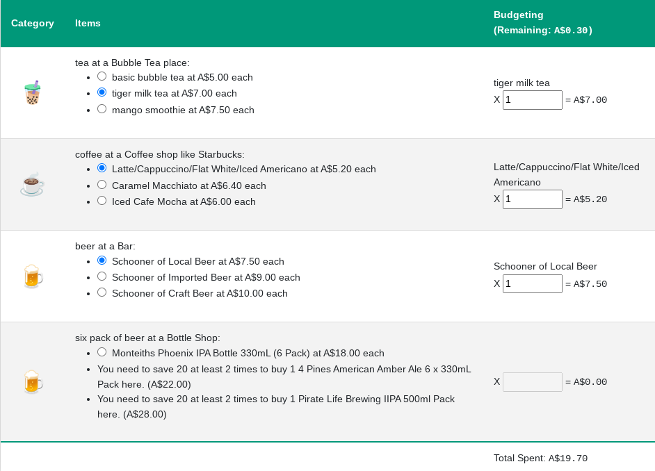
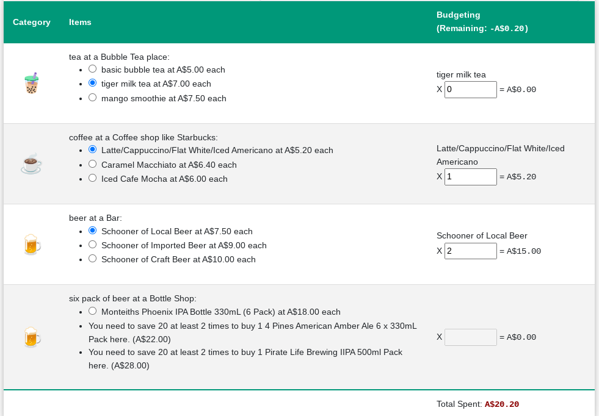

I came across the book [The Art of Frugal Hedonism by Australian authors
Annie Raser-Rowland and Adam Grubb](https://www.frugalhedonism.com/) in
which they talk about ways to enjoy the pleasurable things in life while
remaining frugal.

Some ideas they discuss:

-   Have a picnic instead of going to a restaurant
-   Go out to restaurant, but avoid buying alcohol, just have a meal and water
-   Have friends over and drink for a barbecue and a beer instead of
    going out.
-   Find a cheap or free "third-place" (a place that's neither
    work/school or home) that you can hang out at without spending much
    money -- a park or community centre or local coffee spot.

I shan't quote all their ideas because the book is worth a read - it's
quite easy and light to read anyway.

Some of these are common sense, but even so, it's good to get one
thinking about one's spending and activities regardless.

# TL;DR: #
[The Art of Frugal Hedonism by Australian authors
Annie Raser-Rowland and Adam Grubb](https://www.frugalhedonism.com/) is a good book. Play with my app at [money-choices.info](https://money-choices.info) and think about alternative spending for some given amount of money. Or plan a budget or more frugal night out.

# Unit Cost Alternatives

I'm also interested in how you can spend less, but still do the same
things, rather than just not spending at all. How can you get more value
out of the same amount of money by buying things that better resonates
with you?

I can answer that with a personal project I've been building on and off
for a year now. *(Actually, I started years ago, but only got back to it
recently.)* My personal project is a calculator website where you can
enter a spending amount and it can tell you how many different other
items you could get for that amount. (See it now at
[money-choices.info](https://money-choices.info).) For example, spending
\$50 on Entertainment could get you either:

-   6 months subscription to Netflix with ads OR
-   4 cinema tickets at \$12 each
-   BUT you need to save that \$50 3 time to pay for a theme park
    ticket.

Thinking of your discretionary spending in unit costs could help to
decide if a certain cost is worth that money to you and your own values.
You might find that for the cost of a cinema ticket you could get a
month's Netflix subscription which might be better value for you. Or if
you really like going to the cinema, then you could think about how to
spend efficiently on your pre-cinema drinks. My app does the same thing
with drinks too - so say you want to spend \$20 on drinks before the
cinema you could choose either:

-   2x Tiger Milk bubble teas OR
-   3x Iced Cafe Mocha OR
-   2x Schooners of Craft Beer

Or of course, a mixture of these but I haven't included that here.

*While these prices are made up, they are not completely wrong (but may
be out of date) - I based them off observed prices in my local area and
used Microsoft Copilot to generate prices based on some price listing
sites from 2020 - 2022.*

You can view the site now at
[money-choices.info](https://money-choices.info)

# Unit Cost Budgeting

My friend was telling me that he was budgeting for drinks for the month,
so I decided to take the same methodology and allow people to use it for
calculating their budgets for that category. So you can estimate how
many coffees you drink each week or month, how many beers you drink or
bubble teas you enjoy and use that to calculate your spending. And of
course I disable any options that you can't afford at all.

Or work the other way and estimate spending or even create a spending
plan for a scenario like the pre-cinema drinks from above.

So, to plan a pre-movie drinks evening, you could enter 1 of each -
bubble tea, Latte, Beer spending \$19.70.

Alternatively, you may think you\'ll buy 2 beers and a hot chocolate in
the cinema which would also put you close to or just above \$20.

Of course, you don\'t have to spend all your budgeted amount, so you
could instead buy either a beer or bubble tea, saving yourself about
\$7 - \$10.

Whichever way you want to use this tool, have fun thinking about your
spending choices.

You can view the site now at
[money-choices.info](https://money-choices.info)

# Technical Development

I\'ve been taught to do projects in an incremental way so that early in
the development you have a workable prototype, then you can enhance it
closer to the end-product as you go. I built the Unit Cost Alternatives
in this way:

1.  I programmed the logic with totally static data.
2.  Then when I was happy with the logic and display, I extended to
    shared components, passing the static data around, just from the
    filesystem.
3.  Eventually I restructured the app to ease development and fetch the
    data on load.

At each step I had a working app for my own learning, and the next
enhancement wasn\'t too onerous.

On my other blog, I have a short write-up of the user-experience
iterations I went through. You can read that at my [Projects Blog --
Unit Cost
Fun](https://www.acarrick.com/projects/new-project-unit-cost-fun/).

Making the budgeting part of this involved a lot of learning as I needed
to learn how to correctly pass the React state up the application and
calculate the totals, while not actually knowing what items there could
be at design-time. I built the app in a way that I can just update the
data and add more categories or items without changing the application
logic, that was more challenging but more rewarding too. I ended up
using a Map data-structure, maintaining the sub-totals in the parent
object and the chosen item and quantities in the child objects for each
category of spending.

## Technical Resources

Following is a list of some resources I used:

-   [Map.prototype.set() - JavaScript \| MDN
    (mozilla.org)](https://developer.mozilla.org/en-US/docs/Web/JavaScript/Reference/Global_Objects/Map/set)
-   [JavaScript Map forEach() Method
    (w3schools.com)](https://www.w3schools.com/jsref/jsref_map_foreach.asp)
-   [The 23 Best Web-Safe HTML & CSS Fonts for 2024
    (hubspot.com)](https://blog.hubspot.com/website/web-safe-html-css-fonts)
-   [Map.prototype.set() - JavaScript \| MDN
    (mozilla.org)](https://developer.mozilla.org/en-US/docs/Web/JavaScript/Reference/Global_Objects/Map/set)

(Actually, I used a lot more in the research, but the unused Stack
Overflow answers are irrelevant here!)
