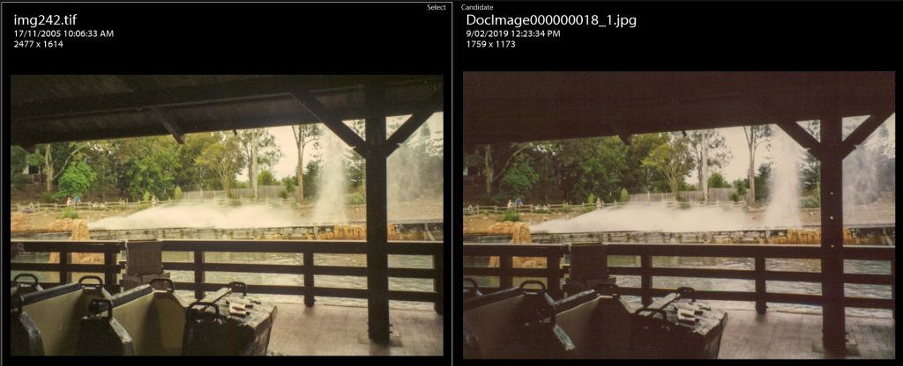

I’ve got a bunch of old photos to scan – some, where I have the negatives still, and some, where I only have the prints. I scanned a few some months back using the [Kodak Rapid Scanner](http://pfsny.com/M/Kodak/Kodak-Kiosks/Kodak-Rapid-Scanner_.html) kiosk available for use in department stores as an experiment but wasn’t happy with the results. I figured if I could scan the negatives I’d achieve richer photos. Recently I’ve been able to borrow a friend’s [Epson Perfection V370 Photo](https://www.epson.com.au/products/scanner/perfectionv370photo.asp) scanner with a film module and a flatbed.

So while scanning the negatives I have (including of the same photos from before) I was able to experiment with the scanned images and compare: scans from negatives, scans from prints on the Epson flatbed, and scans from the Kodak Rapid Scanner.

Goals
-----

My overall goals for this project are have digital copies of all my old photos of family and vacations etc (pre-digital photography) so I can add them to my Lightroom catalogue and add key words and dates like the others.

So my goals for the experiments are:

*   Compare scanned negatives to scanned prints
*   Compare Epson print scanning with Kodak kiosk print scanning
*   Determine overall course of action based on quality and ease-of-implementation

### Compare scanned negatives to scanned prints

TL;DR: Scan negatives if you have them.

**Quality:** The quality of the scanned negatives were much better than the quality of scanned prints from using the same scanner (because the Epson has both negative/film scanning and a flatbed scanner). I was able to get more dynamic range out of the negatives – scenes on the prints that are dark are much more exposed when I scan the negative, the brighter areas aren’t so bright that I can’t adjust them in Lightroom if needed. With the prints, there isn’t much correction you can do on the highlights or shadows, similar to a JPEG compared to the dynamic range and correction ability of a RAW image.

I didn’t notice much difference in sharpness or detail though.

A theme park ride. There is much more detail in the shadows in the scanned negative. (Left image)

A theme park ride. There is much more detail in the shadows in the scanned negative (left).

**Ease of use:** Scanning negatives on the Epson Perfection wasn’t hard, and after a few I got into a pattern.

1.  Place 4 – 6 35mm negatives (sliced from the film processor) in the guides, and gently lock it in place.
2.  Lift flatbed and setup the negative scanner together with negatives in appropriate position.
3.  Start a preview scan in the Epson Software. It takes about 30 seconds
4.  Select the photos, rotate and/or flip if necessary.
5.  Choose noise removal, colour correction, and dust removal if needed.
6.  Press Scan button and scan to TIFF in at least 1200 – 1500 DPI. It takes about 2 – 3 minutes for 4 exposures depending on resolution.

After a few I realised it’s easier to place the negatives on the plastic guide outside the scanner then place the whole guide on the scanner. I also realised that if I put the curve of the roll up, it’s already flipped the correct way for that scanner. Of course, if you adapt my experiences to a different scanner, you may have to experiment with the film insertion. I tried up to 2400 DPI but I didn’t seem to get much better detail, maybe you might want to if you had a specific need, like large reprints or something.

While it’s scanning, I just do something else on my computer or do something in the room for 2 minutes. The key is finding something to do that doesn’t take much concentration but is nearby the computer so after 2 minutes you can stop and place more film in the scanner. Ideas:

*   Sorting through emails.
*   Watching stand up comedy on TV or YouTube.
*   Folding laundry
*   Keyword tagging existing photos in Lightroom
*   Puzzle games on the computer or phone
*   Put the kettle on and make a batch of iced tea

**Verdict:** Find an hour or so per roll (less as you get more experience), and scan as many negatives as you have.

### Compare Epson print scan with Kodak kiosk print scan

**Quality**: They are about the same quality. I couldn’t get any better image data (light/dark dynamic range) out of the Epson. Images from the Epson scanner seemed slightly sharper, but a slight sharpness increase in Lightroom applied to the ones from the Rapid Scan and I couldn’t notice any difference.

A theme park show. After adjusting the sharpness / contrast, the quality is about the same. Left is from the Rapid Scan, right is from the flatbed.

Epson Scan on the left, Rapid Scan on the right. I couldn’t bring out the shadow detail any more for either of them, compared to the negative above.

I also tried scanning in prints at higher resolutions than 300 dpi (the Rapid Scan’s resolution), and I couldn’t see any more actual details (like text or facial details) at 600 dpi than 300. Technically you may get a higher quality printout (less pixelated), but a decent RIP in a printer should be able to resample it to print out A2 without being pixelated. I suspect when you see really pixelated food on shop windows they actually only supplied the designer with an image around 100 pixels in length. (I should add though, I’m not a professional photographer, I work in a printing business for awhile though doing banners and posters. Your use case may vary, try some test prints.)

**Ease of use:** The kiosk Kodak Rapid Scan II was much easier to use, after scanning over 500 prints in Kmart (a discount department store), my girlfriend and I became adept at it:

1.  separate them into bundles of ~20
2.  place them in the auto document feeder, press start on the kiosk terminal
3.  while they are scanning bottom of the pile first, grab the next pile and hover it above the ADF
4.  when it finishes scanning i.e. the ADF is empty, you have 10 – 15 seconds to put the next bundle in without having to press start again.
5.  While scanning, watch the ADF and terminal in case any 2 are scanned together and skipped. If so, make a note and check, redoing if needed.

We managed to scan 477 in 2.5 hours, and another bundle of 64 later even faster in about 20 minutes.

By contrast, using the flatbed scanner during my experiments I had to:

1.  carefully place 4 photos on the scanner, portrait to fit
2.  hope they were straight, which they may not be
3.  carefully draw marques around each image, then select all 4 to scan
4.  press scan at 300 dpi (the same as the Kodak Rapid Scan II)
5.  Repeat for another 4 at a time.

This involves constantly opening the scanner and placing 4 photos on, gathering up the last 4 with your fingers… I feel like it would take all day rather than just 2 hours and $10. Plus, you’d have to have the flatbed scanner. I was lucky enough to be able to borrow one.

**Verdict:** Rapid Scan for as many as possible, flatbed when the images are too large for the photo scanner.

Overall course of action
------------------------

Based on the above experiments and experiences I am digitising my photos in the following way:

1.  Scan all the negatives I can find with the Epson Perfection.
2.  Scan all the odd sized photos on the Epson Perfection flatbed like large reprints, class year photos, souvenir photos. I generally scanned these in at around 300 to 400 DPI. I ended up saving them in JPEG at 90% quality because I didn’t seem to get any better dynamic range in TIFF from prints (as above) and I didn’t want to take up the extra disk space.
3.  Scan all the remaining 3×5 prints using the Rapid Scan in Kmart over as many weeks as I feel like taking. The scans come on a DVD available for collection the next day.

As I digitise the photos, now I have the task adding metadata in Lightroom – dates, locations etc. I continue this with some metadata correction in [Fixing Photo Metadata with Exiftool](/fixing-photos-metadata-with-exiftool)