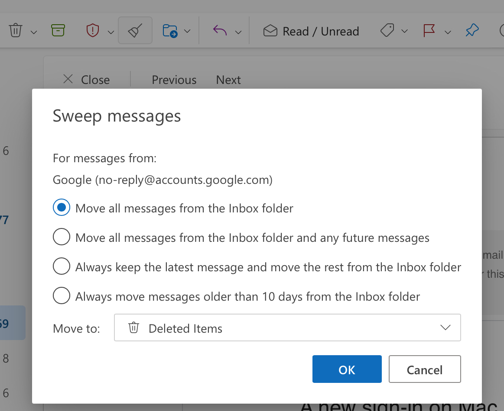
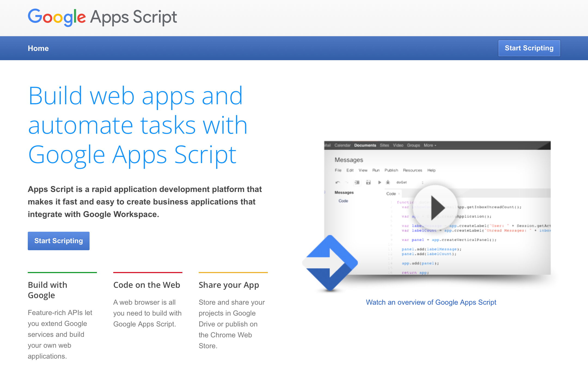

# Outlook

In Outlook.com I make extensive use of Outlook‘s Sweep rules to automatically move emails to folders after 10 days or keep only the most recent email.

Sweep rules can:

* Move all messages from the inbox from that sender
* Move all and future in the inbox from that sender
* Keep only the most email, moving the emails from that sender to a folder or trash
* Always move messages older than 10 days to a folder or trash from that sender



I use the last two rules depending on the types of email:

1. For some emails, I only need to see the one most recent because those emails supersede previous, like hosting services update reminders or certain kinds of newsletters.
2. Emails from Meetup.com for example I‘m happy to delete them after 10 days, but I also use that 10 days to move *particular* emails to a folder of Meetup emails for my records. Like, I don’t to keep every new meetup scheduled, but I want a copy of emails about meetups that I attended.
3. Newsletters I’ll move into a folder for that newsletter after 10 days, because I want to see the few most recent.

Then I’ll use ordinary Filters in Outlook to filter emails that can’t be picked up as precisely by Sweep, just because that feature doesn’t have the same control over triggered emails.

# GMail

Gmail doesn’t actually have a Sweep feature unfortunately, only Filters, so I can’t automatically have it Archive emails after 10 days.

However, I came up with a work around, [Google Workspace Apps](https://script.google.com) Script. It doesn’t actually require a paid Workspace account, it works on the free Gmail too.



With the help of some random website and Tom Scott for pointing out the existence of Apps Script in the first place, I came ended up with the following script that automatically archives (removes the Inbox label) on all emails already with a label after 10 days. I schedule the script to run every day.

```
function archiveSweep() {
  var delayDays = 10;
  var maxDate = new Date();
  maxDate.setDate(maxDate.getDate() - delayDays);

  var threads = GmailApp.getInboxThreads();

  for (var i = 0; i < threads.length; i++) {
    if (threads[i].getLastMessageDate() < maxDate) {
      if (threads[i].getLabels().length > 0) {
        threads[i].moveToArchive();
      }
    }
  }
}

```

It’s just plain JavaScript that with Google classes for their own stuff.

I still use Gmail’s normal Filters system for adding labels to emails, so this will just archive them after 10 days.

This approach does have some caveats though. 

1. I have no easy control over which emails are archived without editing the script to have custom code for specific senders. But that’s easy enough to do if I wanted to. 
2. Google Account Security keeps reminding me something is authorised to have full control over my account. Which is good, but unnecessary since I wrote the script and authorised Google’s own technology.

The web based script editor in Apps Script uses the Monaco editor and even has some sort version control built in, and a debugger.